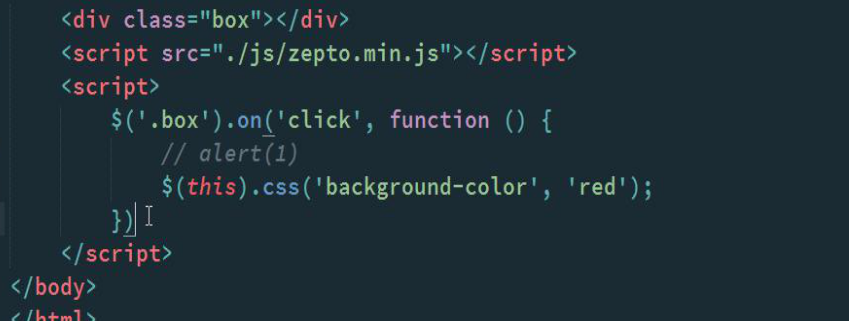
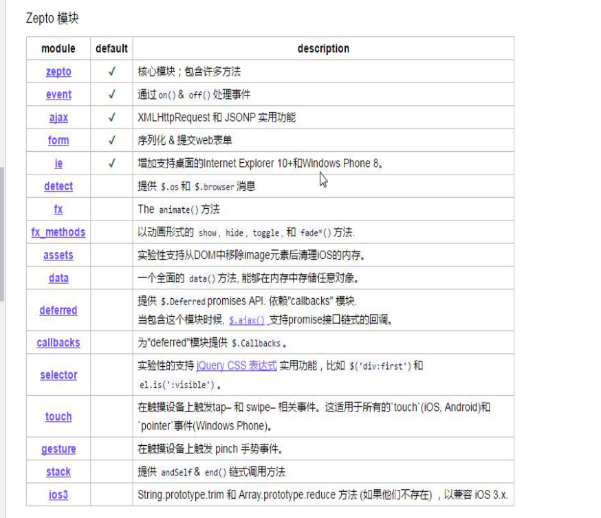

有些不了解zepto的同学在刚接触的时候肯定有很多疑惑，这个东西怎么用啊，去哪里下载啊，什么时候该用什么时候不该用啊，其实我以前也是这样的。jquery使用多了那么就让我们一起来了解下zepto把。

在移动端用不着pc端兼容难么多的浏览器，所以就有了zepto.js，如果此时用jquery的话就有些重了，现在pc端可以使用jquery，但是反过来的话pc端如果用zepto,js的话就不怎么兼容ie浏览器了。 

这个库几乎和jquery 一样。使用上没什么区别，用法一样，可以理解为zepto.js仿照的jquery.
绑定事件和jquery一模一样，用下面这个改变背景色的小例子来说明一下↓

此时的用法和jquery，只需要引入zepto文件即可。

但是zepto也不完全和jquery一样，在zepto里面有些功能是默认没有的，比如说animate方法,此时如果想用的话需要在zepto里面增加一个fx模块。因为zepto是基于模块来管理的（将某些特定的功能独立出来形成一个单独的js文件，称为模块）。

之所以采用模块的方式是因为为了提高性能，需要哪个模块的功能就添加哪个模块。

zepto默认是有五个模块的，分别为zepto、event、ajax、form、ie，这五个模块被称为核心模块。

下面这张图是zepto里面的所有模块。

那么如何在zepto里面增加和删除模块呢？

1、首先要安装node.js环境；

2、去zeptojs.com网站下载安装zepto.js,然后解压缩

3、打开cmd命令窗口进入解压缩后的zepto目录（解压后的这个解压文件夹里面） 。

4、执行npm install 命令

5、然后编辑make文件，添加需要的自定义模块并保存

6、然后执行命令 npm run-script dist

7、此时会生成一个dist文件，查看目录dist即构建好的zepto.js

 这时候直接引入你的zepto文件就可以用啦。

在这里我只说了一下zepto的下载和使用，具体模块下的方法请到官方的说明文档查看。

纯手打，如有错误请大家提出指正。